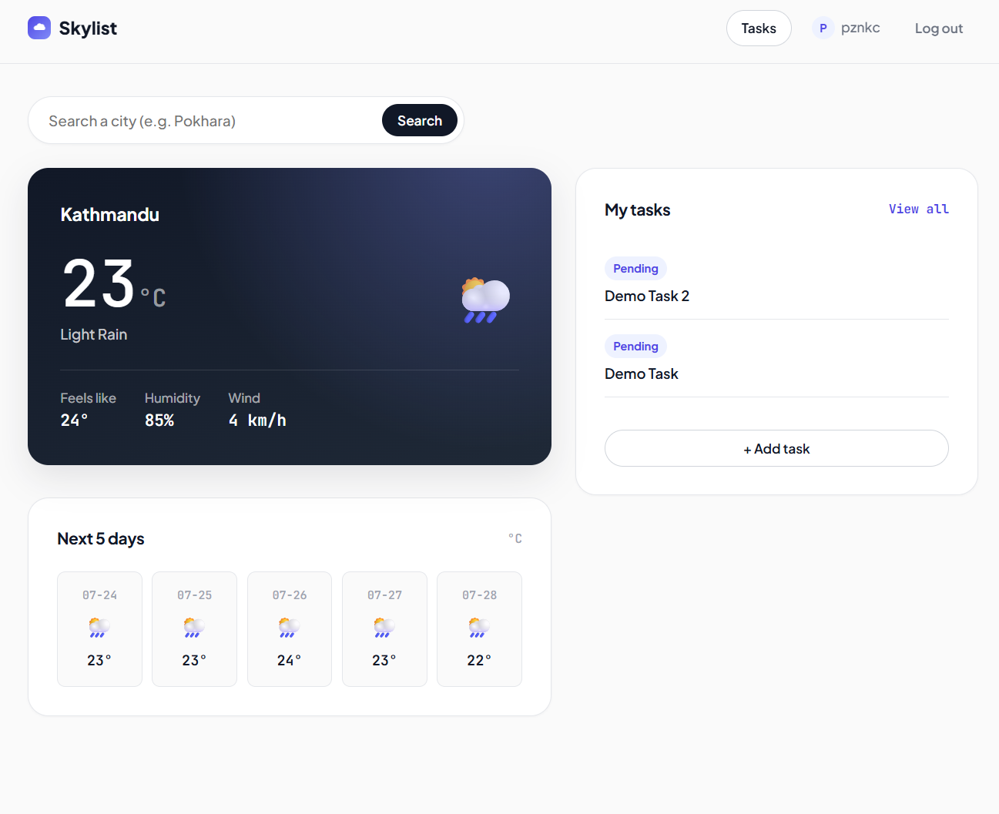

# Skylist 🌤️ — Weather + Todo

Skylist pairs real-time weather with a simple task manager, so you can plan
your day around the sky instead of switching between two different apps.

Built with Django, vanilla HTML/CSS/JS, and the OpenWeather API — no
frontend framework, no ORM shortcuts skipped.

---

## Screenshots

<!--
  Add screenshots below as you take them. Suggested shots, roughly in the
  order a visitor would see them:

  1. Landing page (logged out) — full hero, showing the split layout with
     the weather card + search bar on the right.
  2. Landing page — scrolled down slightly to show the "Sign up to track
     tasks" promo card.
  3. Register page.
  4. Login page.
  5. Dashboard (home) — logged in, showing real weather + 5-day forecast
     for a real city (not the placeholder "Kathmandu, 22°C" demo data).
  6. Dashboard after searching a different city, to show that feature.
  7. Todo list — with a mix of pending and completed tasks, so the badges
     and strikethrough style are both visible.
  8. Add-task form.
  9. (Optional) Mobile/responsive view of the dashboard, if you test it at
     a narrow viewport width.

  Save images into a /screenshots folder in the repo root, then reference
  them like this:

  
  
  
-->

---

## Features

**Weather**
- Real-time current weather, resolved automatically from the visitor's IP
  address — no location permission prompts, no setup
- Manual city search (OpenWeather Geocoding API) as an override, available
  from both the landing page and dashboard
- 5-day forecast strip
- Location caching per user to avoid re-hitting the geolocation API on
  every page load

**Todo**
- Create, complete/undo, and delete tasks
- Created + completed timestamps shown per task
- Tasks are private per account — every query is scoped to the logged-in
  user

**Accounts**
- Register, log in, log out
- Dashboard and task list both require authentication

---

## Tech stack

- **Backend:** Django 6, Python
- **Database:** SQLite (development) — swappable for PostgreSQL in production
- **Frontend:** Hand-written HTML/CSS/JS (no framework), Google Fonts
  (Plus Jakarta Sans, JetBrains Mono, Fraunces)
- **APIs:** [OpenWeatherMap](https://openweathermap.org/api) (current
  weather, 5-day forecast, geocoding), [ip-api.com](https://ip-api.com)
  (IP → location)
- **Config:** `python-decouple` for environment variables
- **Testing:** Django's `TestCase`/`SimpleTestCase` with `unittest.mock`
  for external API calls

---

## Project structure

```
weather/             # Django project config (settings, root urls)
weathersite/          # Weather app — views, services (API calls), models
  ├── services.py      # IP geolocation + OpenWeather API integration
  ├── templates/weathersite/
  └── static/weathersite/
todo/                 # Todo app — Task model, CRUD views
  └── templates/todo/
```

---

## Getting started

### 1. Clone and set up a virtual environment

```bash
git clone https://github.com/<your-username>/Weather-Todo-App.git
cd Weather-Todo-App
python -m venv venv
venv\Scripts\activate        # Windows
# source venv/bin/activate   # macOS/Linux
```

### 2. Install dependencies

```bash
pip install -r requirements.txt
```

### 3. Set up environment variables

Create a `.env` file in the project root (same folder as `manage.py`):

```
SECRET_KEY=your-django-secret-key
OPENWEATHER_API_KEY=your-openweathermap-api-key
```

Get a free API key at [openweathermap.org/api](https://openweathermap.org/api)
— new keys can take up to a couple hours to activate.

### 4. Run migrations

```bash
python manage.py migrate
```

### 5. Start the dev server

```bash
python manage.py runserver
```

Visit `http://127.0.0.1:8000/`.

---

## Running tests

```bash
python manage.py test weathersite
```

Tests cover `services.py` (IP geolocation, weather, forecast, and
geocoding lookups) using mocked API responses — no real network calls or
API quota used during testing.

---

## Roadmap

- [ ] Task priorities and reminders
- [ ] Password reset flow
- [ ] PostgreSQL for production
- [ ] Deploy (Render/Railway)
- [ ] Class-based view refactor for todo CRUD

---

## License

This project is open source and available under the [MIT License](LICENSE).

---

## Author

Built by [PuzanKC] — [your portfolio / LinkedIn / GitHub link].