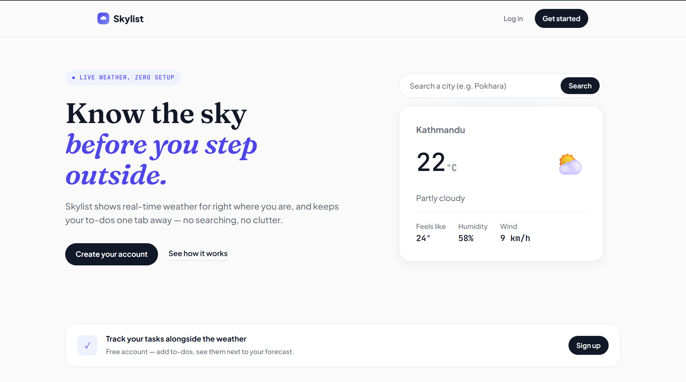
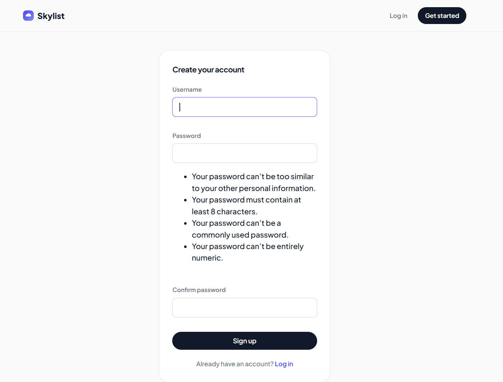
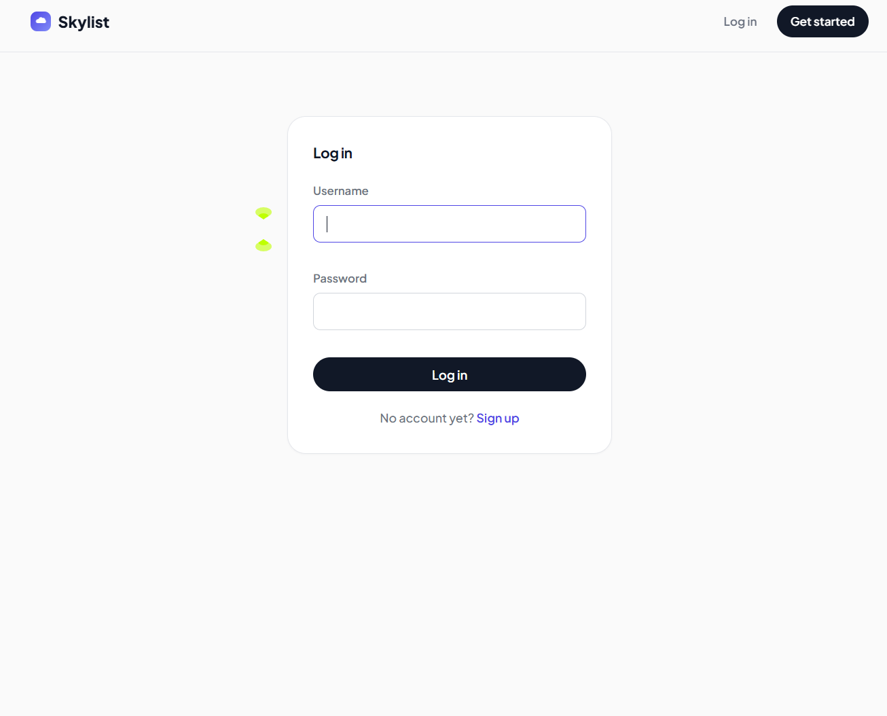
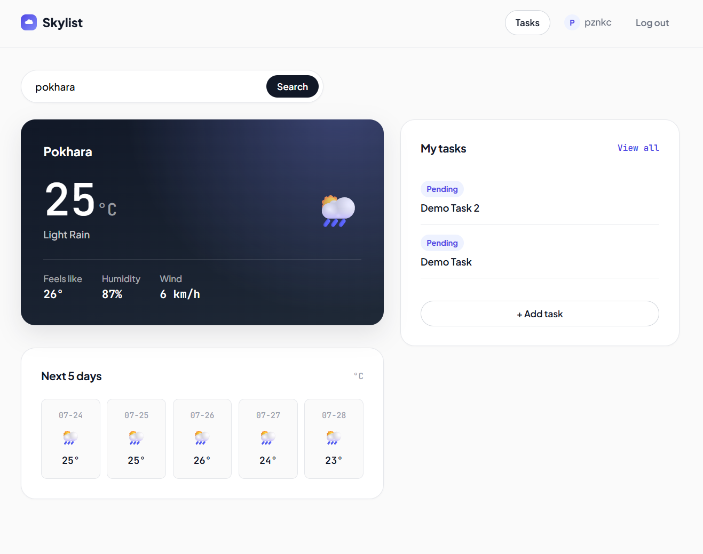
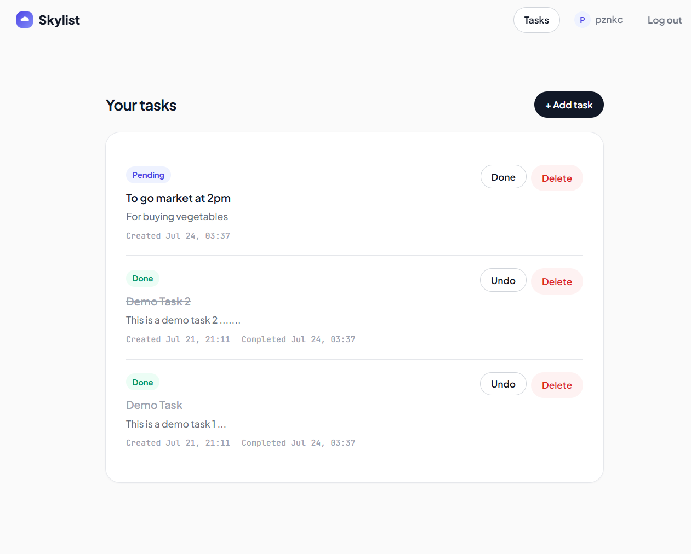
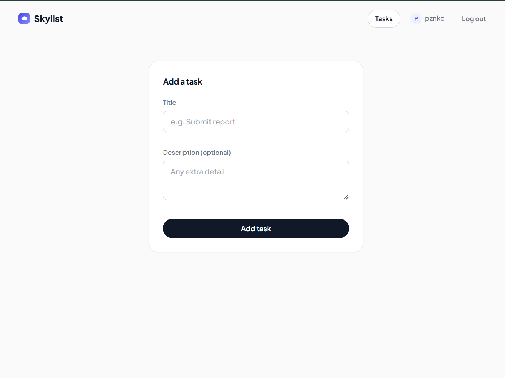
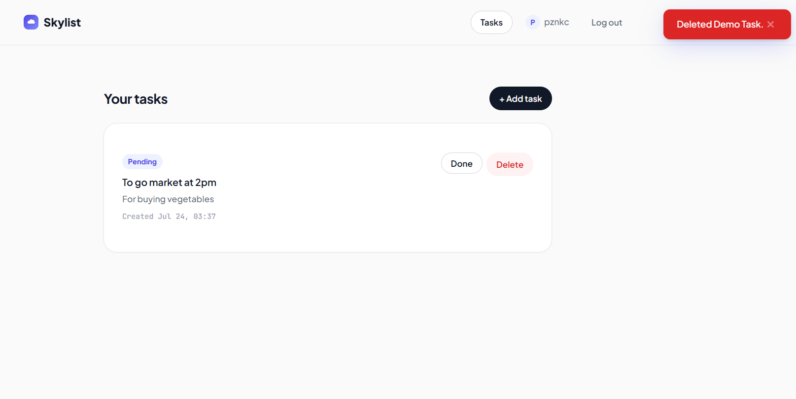
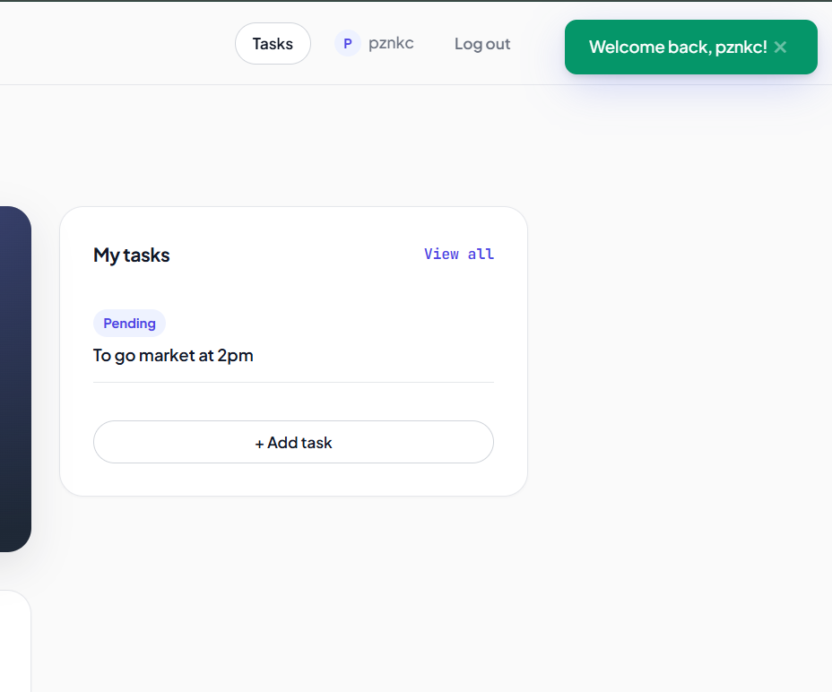
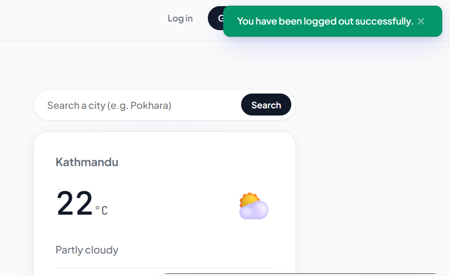

# Skylist 🌤️ — Weather + Todo

Skylist pairs real-time weather with a simple task manager, so you can plan
your day around the sky instead of switching between two different apps.

Built with Django, hand-written HTML/CSS/JS, and the OpenWeather API — no
frontend framework, no shortcuts on the backend logic.

---

## Screenshots

### Landing Page


### Sign Up


### Log In


### Dashboard


### Dashboard — Searching a Different City


### Task List


### Add Task


### Toast Notifications




---
## Features

**Weather**
- Real-time current weather, resolved automatically from the visitor's IP
  address — no location permission prompts, no setup
- Manual city search (OpenWeather Geocoding API) as an override, available
  from both the landing page and dashboard
- 5-day forecast strip
- Graceful fallback messaging if a searched city can't be found, or if the
  weather API call fails

**Todo**
- Create, mark complete/undo, and delete tasks
- Created + completed timestamps shown per task
- A "My tasks" preview panel on the dashboard, right alongside the weather,
  so today's forecast and today's to-dos are one screen
- Tasks are private per account — every query is scoped to the logged-in
  user, so one user can never see or modify another's tasks

**Accounts**
- Register and log in (Django's built-in auth, backed by `UserCreationForm`)
- Dashboard and task list both require authentication

**Feedback**
- Toast notifications (Toastify-js) for task actions and auth errors,
  styled to match the site's own design tokens rather than a generic
  plugin look

---

## Tech stack

- **Backend:** Django 6, Python
- **Database:** SQLite (development) 
- **Frontend:** Hand-written HTML/CSS/JS (no framework), Google Fonts
  (Plus Jakarta Sans, JetBrains Mono, Fraunces), Toastify-js for notifications
- **APIs:** [OpenWeatherMap](https://openweathermap.org/api) (current
  weather, 5-day forecast, geocoding), [ip-api.com](https://ip-api.com)
  (IP → location)
- **Config:** `python-decouple` for environment variables
- **Testing:** Django's `TestCase`/`SimpleTestCase` with `unittest.mock`
  for external API calls (no real network calls or API quota used in tests)

---

## Project structure

```
weather/                    # Django project config (settings, root urls)
weathersite/                # Weather app — landing page, dashboard, auth views
  ├── migrations/
  ├── models.py               # UserLocation (location cache)
  ├── services.py              # IP geolocation + OpenWeather API integration
  ├── urls.py
  └── views.py
todo/                       # Todo app — Task model, CRUD views
  ├── migrations/
  ├── models.py
  ├── urls.py
  └── views.py
templates/                  # Project-level templates (shared across apps)
  ├── weathersite/            # index, home
  ├── auth/                   # register, login
  └── todo/                   # task_list, task_form, task_confirm_delete
static/
  └── weathersite/            # style.css, shared design system
screenshots/                # README screenshots
```

---

## Getting started

### 1. Clone and set up a virtual environment

```bash
git clone https://github.com/<your-username>/Weather-Todo-App.git
cd Weather-Todo-App
python -m venv venv
venv\Scripts\activate        # Windows
# source venv/bin/activate   # macOS/Linux
```

### 2. Install dependencies

```bash
pip install -r requirements.txt
```

### 3. Set up environment variables

Create a `.env` file in the project root (same folder as `manage.py`):

```
SECRET_KEY=your-django-secret-key
OPENWEATHER_API_KEY=your-openweathermap-api-key
```

Get a free API key at [openweathermap.org/api](https://openweathermap.org/api)
— new keys can take up to a couple hours to activate.

### 4. Run migrations

```bash
python manage.py migrate
```

### 5. Start the dev server

```bash
python manage.py runserver
```

Visit `http://127.0.0.1:8000/`.

---

## Running tests

```bash
python manage.py test weathersite
```

Tests cover `services.py` — IP geolocation, current weather, 5-day
forecast, and city-search geocoding — all using mocked API responses.

---

## Roadmap

- [ ] Task priorities and due-date reminders
- [ ] Password reset flow
- [ ] PostgreSQL for production
- [ ] Deployment (Render/Railway)
- [ ] Class-based view refactor for todo CRUD

---

## License

This project is open source and available under the [MIT License](LICENSE).

---

## Author

Built by **Pujan Khatri**

- LinkedIn: [pznkc](https://www.linkedin.com/in/pujankc)
- GitHub: [pznkc7](https://github.com/pznkc7)